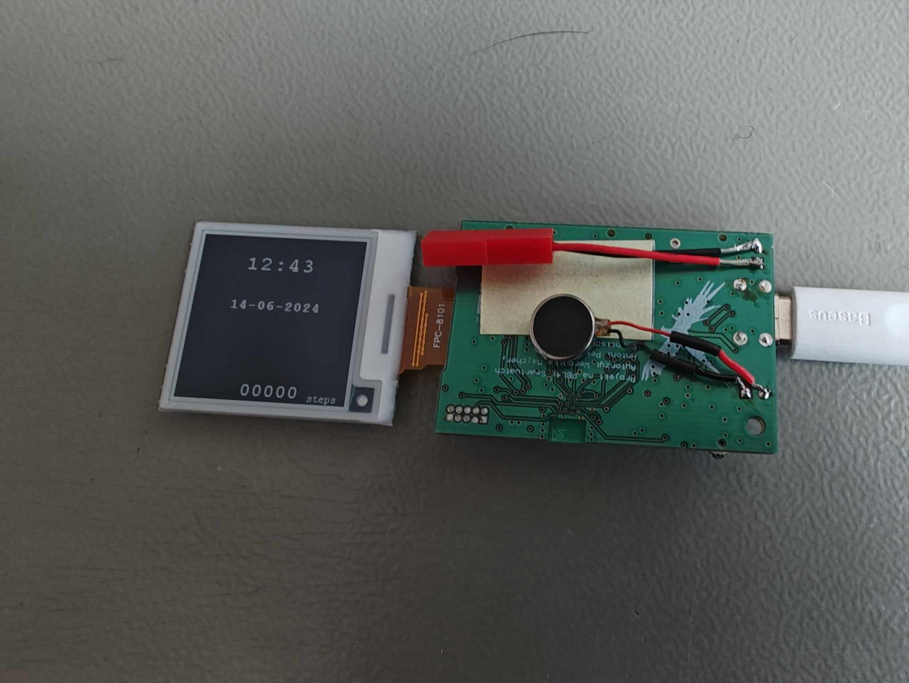

# Smartwatch with Step Counter and BLE Connectivity

A smartwatch featuring a step counter, BLE connection for notifications, and automatic time synchronization with a mobile phone. This project includes a custom-designed PCB, firmware written in C using Zephyr RTOS, and a companion mobile app developed in Flutter.

## Features
- **Step Counter:** Tracks steps using the BMA456 accelerometer.
- **BLE Connectivity:** Connects to a mobile phone for notifications and time synchronization.
- **E-paper Display:** Provides a clear and power-efficient display.
- **Vibration Alerts:** Integrated vibration motor for notifications.
- **Custom 3D-Printed Case:** Durable and stylish housing for all components.

## Hardware Components
- **Custom PCB:** Designed to integrate all components seamlessly.
- **nRF52833 Microcontroller:** Handles processing and BLE communication.
- **npm1300 PMIC:** Power management for efficient battery usage.
- **BMA456 Accelerometer:** Used for accurate step counting.
- **E-paper Display:** Low-power display for showing time, steps, and notifications.
- **Vibration Motor:** Provides haptic feedback for notifications.
- **Li-Po Battery:** Rechargeable battery for powering the smartwatch.
- **3D-Printed Case:** Custom-designed to house the hardware.

## Software
- **Firmware:** Developed in C using Zephyr RTOS for reliable and real-time performance.
- **Mobile App:** Built with Flutter to handle BLE communication and manage smartwatch settings.
- **BLE Communication:** Allows the smartwatch to sync time and receive notifications from the phone.

# Pictures

